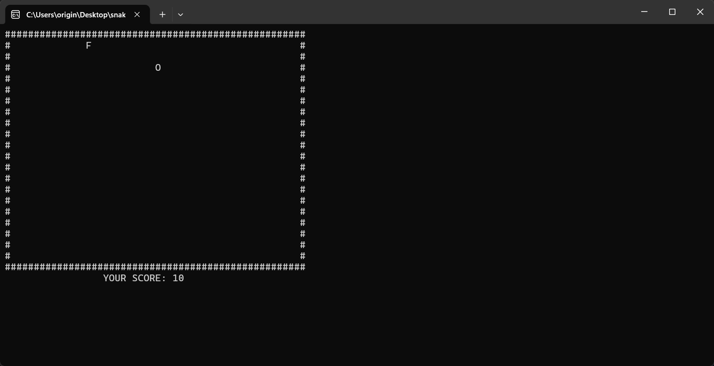

# Snake Game in C

This is a project I built to improve my data structures and algorithm skills in C as a Computer Engineering student at ITU (Istanbul Technical University).



## Features

* **Data Structure from Scratch:** The snake's body is managed using a **Linked List** implemented from scratch in pure C.
* **Flicker-Free Rendering:** Utilizes the Windows Console API (`windows.h`) with `gotoxy()` and `SetConsoleCursorPosition` to prevent screen flickering.
* **Real-Time Input:** Uses non-blocking keyboard input via `conio.h` (`_kbhit()` and `_getch()`) to prevent the game loop from freezing.
* **Collision Detection:** Implemented collision detection for walls, food, and the snake's own body.

## Tech Stack

* **Language:** C
* **Core Data Structure:** Linked List
* **APIs:** `windows.h` (Console API), `conio.h` (Console I/O)
* **Libraries:** `stdlib.h`, `time.h`, `stdbool.h`

## How to Compile and Run

You can compile this project using a GCC (MinGW) compiler. Ensure that `main.c` and `linked_list.c` (and their corresponding `.h` files) are in the same directory.

```bash
# Compile the project
gcc main.c linked_list.c -o snake.exe

# Run the program
./snake.exe